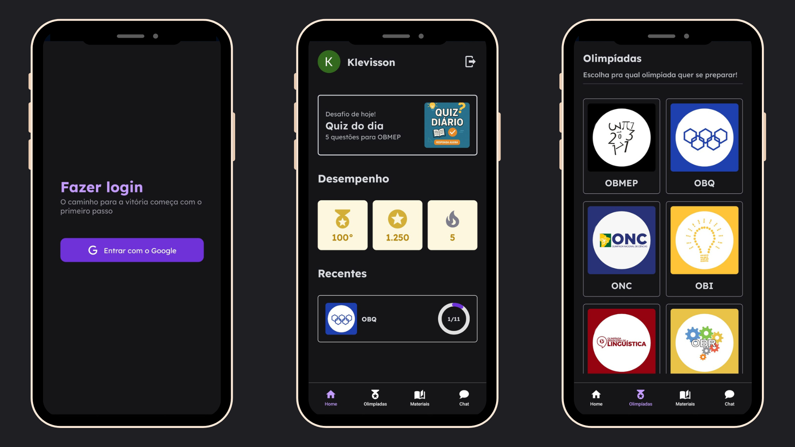
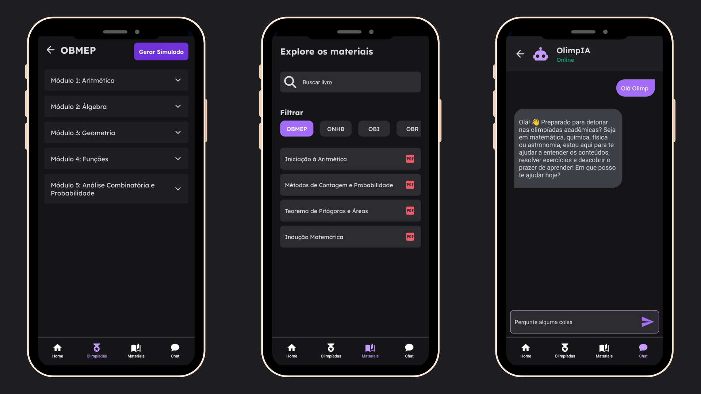

# 📱 OlimPath - Mobile

## Link pra download do APK (OlimPath)
https://expo.dev/artifacts/eas/e3rEuwhgNhRBdAwgWF1W39.apk

O **OlimPath** é um aplicativo mobile feito com **React Native (Expo)** voltado para ajudar alunos do ensino médio, especialmente de escolas públicas, a se prepararem para olimpíadas acadêmicas como:

- 🧮 OBMEP (Matemática)
- 🚀 OBA (Astronomia)
- 🔬 ONC (Ciências)
- 🧪 OBF (Física)
- e outras...

O app oferece **videoaulas**, **simulados com base em provas anteriores**, **biblioteca de materiais em PDF**, e um **chatbot para dúvidas**.

---





---

## 🚀 Tecnologias Utilizadas

- [React Native](https://reactnative.dev/)
- [Expo SDK](https://docs.expo.dev/)
- [TypeScript](https://www.typescriptlang.org/)
- [React Navigation](https://reactnavigation.org/)
- [Axios](https://axios-http.com/)
- [React Native Paper](https://callstack.github.io/react-native-paper/)
- [Clerk Auth](https://clerk.dev/) – autenticação
- [Styled Components](https://styled-components.com/)
---

## 🔧 Como rodar o projeto

### Pré-requisitos

- Node.js instalado
- Expo CLI instalado (`npm install -g expo-cli`)

### Passos

```bash
# 1. Clone o repositório
git clone https://github.com/KlevissonWeskley/olimpath-mobile.git
cd olimpath-mobile

# Atenção: o arquivo .env que deixamos são de chaves de TESTE, que fizemos EXCLUSIVAMENTE para o uso no SEDUCKATHON, elas não comprometem de forma alguma a SEGURANÇA da aplicação.

# 2. Instale as dependências
npm install

# 3. Rode o projeto
npx expo start

# Se for rodar em um computador Desktop que está conectado por rede LAN, use esse comando
npx expo start --tunnel

# Baixe o APK Development Build do projeto - Esse é um APK do Expo, necessário para rodar o projeto:
https://expo.dev/artifacts/eas/opSazXQWThk7VksGHUnfHq.apk

# Depois de rodar o projeto, coloque o link gerado pelo Expo no APK do Expo Development Build

Você pode usar sua própria conta do Expo para rodar o projeto.


